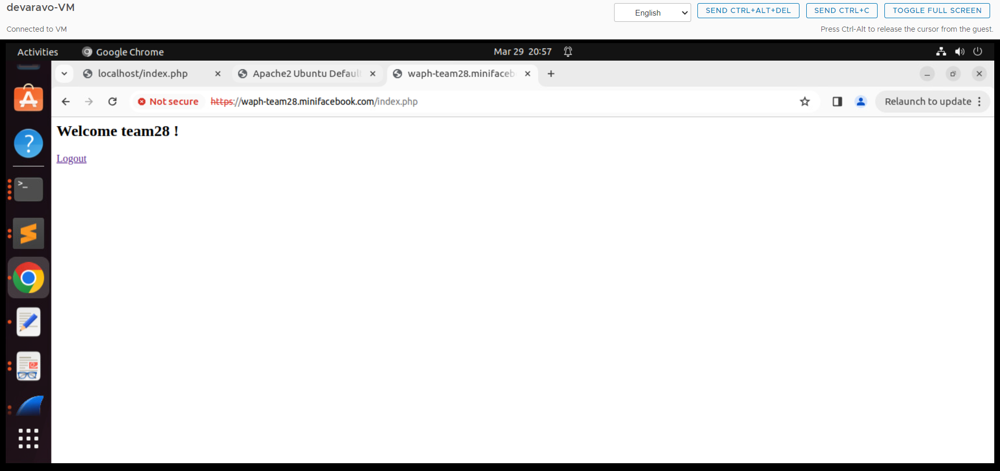
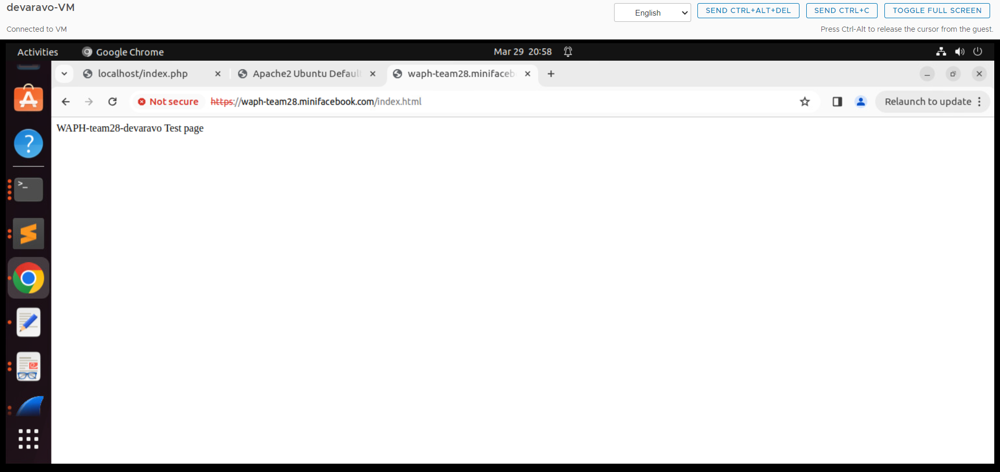

# WAPH-Web Application Programming and Hacking

## Instructor: Dr. Phu Phung

# Mini facebook

# Team members

1. Venkata Ramana Rao Devara, devaravo@mail.uc.edu
2. Member 2, email
3. Member 3, email
4. Member 4, email

# Project Management Information

Source code repository (private access): <https://github.com/waph-team28/waph-teamproject>

Project homepage (public): <https://github.com/waph-team28/waph-team28.github.io>

## Revision History

| Date       |   Version     |  Description |
|------------|:-------------:|-------------:|
| 29/03/2024 |  1.0          | Init draft   |

# Overview

This project involves developing a mini facebook web application using LAMP stack. 

# System Analysis

## High-level Requirements

# System Design

## Use-Case Realization

## Database 

## User Interface

# Implementation

# Security analysis

# Demo (screenshots)

## Venkata Ramana Rao Devara:

- Screenshot demo for login system:
- 
- screenshot demo of index.html page:
- 

# Software Process Management

## Scrum process

### Sprint 0

Duration: DD/MM/YYYY-DD/MM/YYYY

#### Completed Tasks: 

1. Task 1
2. Task 2

#### Contributions: 

1. Venkata Ramana Rao Devara, 6 commits, 6 hours, contributed in initial ssl keys creation, setting up initial login system, setting up local https server, securing cookies 
2. Member 2, x commits, y hours, contributed in xxx
3. Member 3, x commits, y hours, contributed in xxx
4. Member 4, x commits, y hours, contributed in xxx

### Sprint 1

Duration: MM/DD/YYYY-MM/DD/YYYY

#### Completed Tasks: 

1. Task 1
2. Task 2
3. ...

#### Contributions: 

1. Member 1, x commits, y hours, contributed in xxx
2. Member 2, x commits, y hours, contributed in xxx
3. Member 3, x commits, y hours, contributed in xxx
4. Member 4, x commits, y hours, contributed in xxx

#### Sprint Retrospection:

# Appendix

